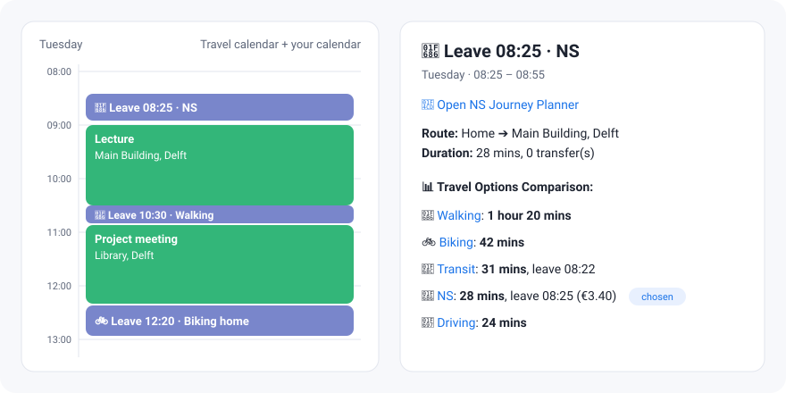

# Auto Schedule Travel Time

A Google Apps Script that reads your Google Calendar and automatically adds **travel blocks** before your events, telling you **when to leave** and **how to get there**.

🌐 **Website:** https://stijnris.github.io/auto-schedule-travel-time/



## Features

- Adds a travel event before every event with a location, titled like `🚲 Leave 08:42 · Biking`.
- Compares walking, biking, public transport (Google Maps), **NS trains** (Dutch Railways) and driving, and picks the best one.
- Every option in the event description is a link that opens that exact travel mode, with **"arrive by"** preset to your event time (so traffic and timetables are right).
- Reads every calendar that is enabled (checked) in Google Calendar; no need to list them. Calendars you enable later are picked up automatically.
- Plans from your previous event's location when events are close together, otherwise from home.
- Adds a return trip home after the last event of the day.
- An all-day event spanning several days with a location means you sleep there (a hotel, staying with family). For an event from Friday to Sunday you leave from home on Friday, start and end Saturday there, and go home on Sunday. Single-day all-day events don't change where you sleep.
- Keeps track of your bike. Leaving from home, public transport starts with a bike ride to the stop or NS station (plus 5 minutes to park) instead of a walk. Later that day your bike stays where you parked it, and the trip home takes you back to it to ride home.
- Not enough time between two events? You get one travel block marked ❗ that leaves when the previous event ends, says how late you'll be and when you'd have to leave to be on time.
- Planned a trip yourself? Add it to the travel calendar and no travel block is added for that trip.
- Keyword rules, e.g. arrive 2 hours early for anything titled "flight".
- Clean up messy locations per calendar with regular expressions, e.g. strip the room number from your university timetable and put the university's name in front.
- Trips longer than 4 hours (usually a location Google Maps got wrong) get no travel block, just a warning in the log.
- Keeps itself up to date: when an event's trip changes (time, location, where you come from, or your settings), its travel blocks are recalculated; deleted events get theirs removed. Unchanged events are left alone.

## Setup

1. Create a new calendar in Google Calendar, e.g. "Travel". Copy its **Calendar ID** (Settings → Integrate calendar).
2. Go to [script.google.com](https://script.google.com/) and create a new project.
3. Download [**`TravelBlocks.gs`**](https://github.com/StijnRis/auto-schedule-travel-time/releases/download/latest/TravelBlocks.gs) (all code in one file, built automatically from [`src/`](src/)) and paste it into the project's `Code.gs`, replacing what's there. Optionally replace `appsscript.json` (Project Settings → Show "appsscript.json" manifest file) to set your time zone.
4. Add your settings in a second file (＋ → Script, name it `Config.local`), starting from [`Config.local.example.gs`](Config.local.example.gs):

   ```js
   const LOCAL_CONFIG = {
     TARGET_CALENDAR_ID: 'abc123…@group.calendar.google.com',
     HOME_LOCATION: 'Stationsplein 1, Utrecht, Netherlands',
     NS_API_KEY: ''   // optional, see below
   };
   ```

   Prefer not to keep them in code? Add them as **Script Properties** instead (Project Settings → Script Properties, same names). A Script Property always wins.
5. Run `syncTravel` (it's the first function, so it's already selected in the editor) and grant the permissions.

That's it. `syncTravel` installs its own triggers: it re-runs whenever an event in one of your calendars changes, and once per day. Every run checks the triggers again, so calendars you enable later get one automatically.

**Updating:** replace the contents of `Code.gs` with the new `TravelBlocks.gs`. Your `Config.local` file stays as it is. All upcoming travel blocks are recalculated once on the next run.

### NS API key (optional)

Sign up at [apiportal.ns.nl](https://apiportal.ns.nl/), subscribe to the **Ns-App** product and put the primary key in `NS_API_KEY`. Run `testNsRoute` to check it works. Without a key the NS option is simply left out.

## Configuration

Every option and its default is listed and documented in the `CONFIG` block of `TravelBlocks.gs` (source: [`src/Config.gs`](src/Config.gs)): which calendars to read, arrival buffer, when to walk or bike, whether driving is allowed, the maximum trip length, NS preferences, your bike and keyword rules.

Don't edit it there, or your changes are gone after an update. Put the options you want to change in your `Config.local` file instead; they override the defaults. Nested objects (`MODE_SELECTION`, `NS`, `BIKE`, `MANUAL_TRAVEL`) are merged, so you only list what changes; lists (`SOURCE_CALENDARS`, `SPECIAL_RULES`) are replaced as a whole.

```js
const LOCAL_CONFIG = {
  TARGET_CALENDAR_ID: '…',
  HOME_LOCATION: '…',
  MODE_SELECTION: { allowDriving: true },
  MAX_TRAVEL_HOURS: 6
};
```

### Cleaning up locations per calendar

Imported timetables often have locations like `Aula - Lecture Room A` that Google Maps can't find. In `SOURCE_CALENDARS` you can rewrite the locations of one calendar with regular expressions (`locationReplace`, applied in order) and then put something in front (`locationPrefix`):

```js
SOURCE_CALENDARS: [
  {
    id: 'abc123…@import.calendar.google.com',
    locationReplace: [{ find: /\s*(-|Hall).*$/, replace: '' }],  // 'Aula - Lecture Room A' → 'Aula'
    locationPrefix: 'TU Delft, '                                   // → 'TU Delft, Aula'
  }
]
```

A calendar can also get a `defaultLocation` for events without one.

### Developing: a local clone

Copy [`Config.local.example.gs`](Config.local.example.gs) to `src/Config.local.gs` and fill in your details. That file is git-ignored, so it never ends up on GitHub; paste it into your Apps Script project as `Config.local`.

To build the single file yourself:

```sh
npm run build   # writes dist/TravelBlocks.gs from src/Code.gs, Config.gs, Routes.gs and NsApi.gs
```

A GitHub Actions workflow runs the tests and this build on every push to `main` and publishes the result to the [`latest` release](https://github.com/StijnRis/auto-schedule-travel-time/releases/tag/latest).

## Testing

The tests run the real `src/*.gs` files in Node.js against fake Google services (Calendar, Maps, NS API, Script Properties), in a shared global scope just like Apps Script. They cover change detection, which events get blocks, the event title/description and how public transport connections are picked.

```sh
npm test        # or: pnpm test  (Node.js 22+, no dependencies)
```

The tests run on every push via GitHub Actions. They prove the script's logic, not the behaviour of the real Google and NS services, so do a real run in Apps Script after bigger changes.

## Notes

- Google Apps Script has daily quotas for Maps requests. Only new or changed events are recalculated (about 5–6 requests each), so after the first run usage stays low. Run `forceRefreshAll` to recalculate everything, e.g. for fresh traffic or timetable data.
- NS API keys for the free "Ns-App" product can only plan between stations, not from an address. The script therefore plans the train from the nearest stations and the way to and from them (bike, walk or local transport) with Google Maps.
- Tracking your bike and biking to stops/stations costs a few extra Maps requests per trip. Walking and biking times are cached for 6 hours.
- Each enabled calendar gets a change trigger (up to 15; Apps Script allows 20 triggers per script). Other calendars are still checked by the daily run.
- The "arrive by" time in Google Maps links uses Google's undocumented URL format; if Google changes it, the link still opens the right route, just without the time.

## License

[MIT](LICENSE)
